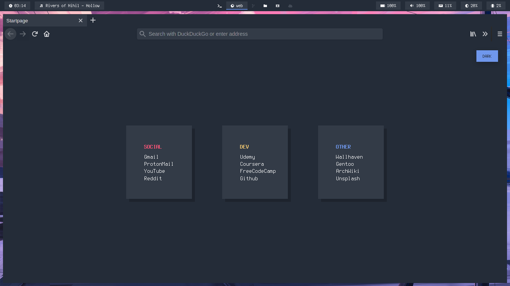
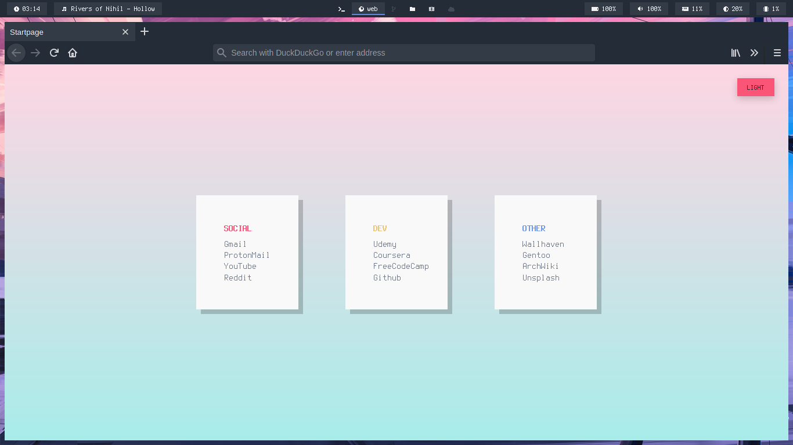

## 
Preview

## 
Installation

#### Startpage -

1. Clone this repository - git clone https://github.com/rajshekhar26/startpage
2. Open firefox and go to Preferences > Home
3. In homepage and new windows add custom URL - file:///home/raj/Projects/startpage/index.html (change the location)
4. Go to newtab folder and open mozilla.cfg in an editor
5. Replace file location of index.html in newTabURL variable
6. Copy mozilla.cfg to /usr/lib/firefox/
7. Copy local-settings.js to /usr/lib/firefox/defaults/pref/

If you can't find /usr/lib/firefox folder, the folder name might be different, for firefox nightly it is /usr/lib/firefox-trunk. It might even be /usr/lib64/firefox, make sure the folder exist and it contains defaults/pref folder.
