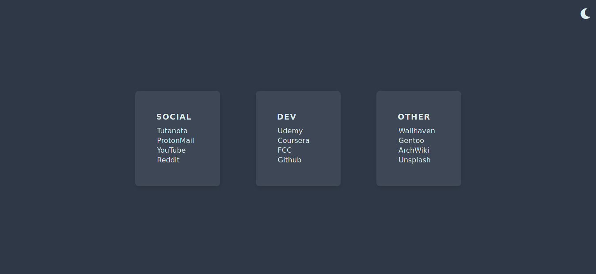
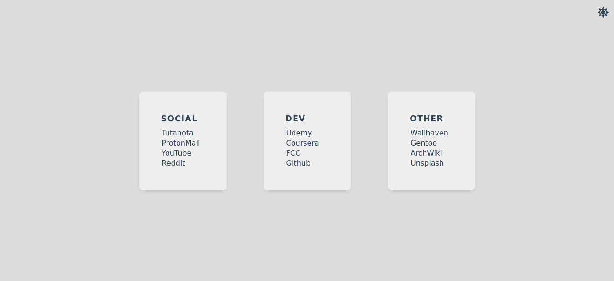

## 
Preview

## 
Installation

- Clone this repository by running the command: `git@github.com:rjshkhr/startpage.git`

- Open Mozilla Firefox and navigate to `Preferences > Home`.

- In the "Homepage and New Windows" section, add a custom URL. Use the following format but replace the file location with your own: `file:///home/yourusername/Projects/startpage/index.html`

- Locate the "newtab" folder and open `mozilla.cfg` in a text editor.

- In the `mozilla.cfg file`, find the `newTabURL` variable and replace the file location with the correct path to your `index.html` file.

- Copy the `mozilla.cfg` file to your Firefox installation directory, typically located at `/usr/lib/firefox/`. Note that for Firefox Nightly, the directory may be named `/usr/lib/firefox-trunk/`. In some cases, it could be `/usr/lib64/firefox/`. Ensure that the folder structure includes `defaults/pref`.
